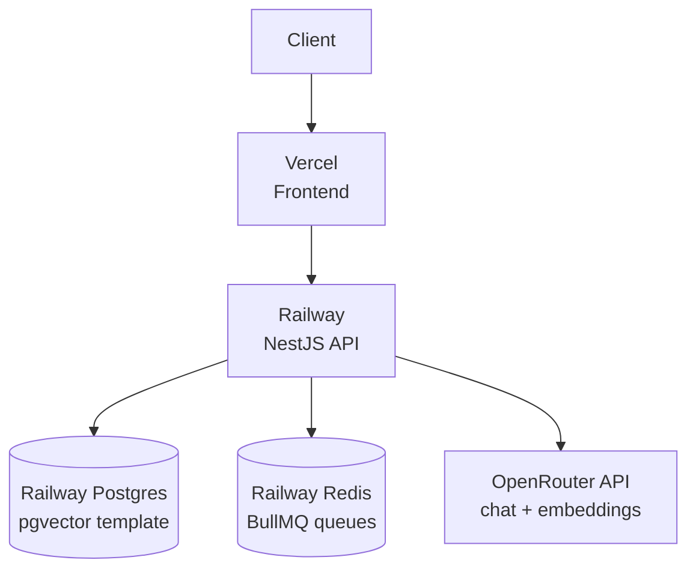
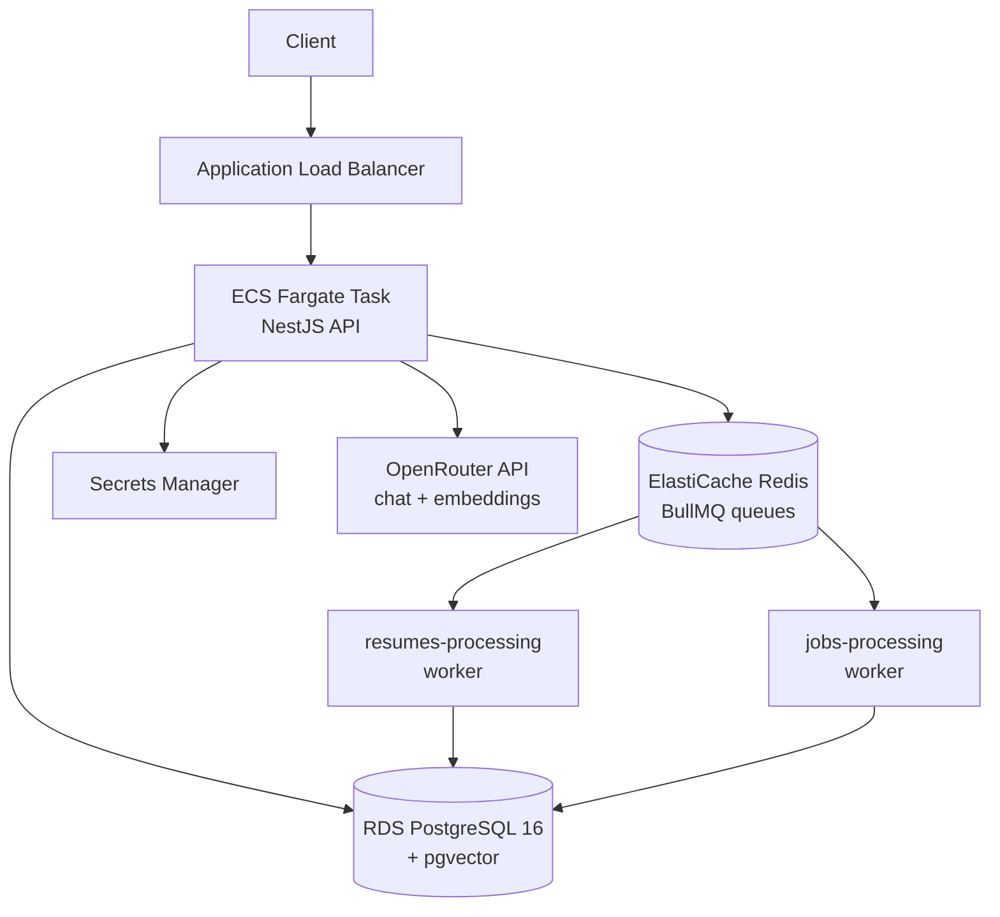

# Job Platform Backend

Upload your CV, get matched to relevant job postings, and see which of your LinkedIn connections already work at those companies — then generate a referral request message for them.

Built with NestJS, PostgreSQL + pgvector, Redis/BullMQ. Deployed on Railway (see [Deployment](#deployment) below).

## Live demo

- App: https://bahattinbober.com
- API health: https://api.bahattinbober.com/health
- Test account: `test@gmail.com` / `123456789`
- The account has a sample CV, 23 job postings, and 19 LinkedIn connections loaded.
- Frontend repo: https://github.com/bahattinbober/job-platform-frontend

---

## The problem

Most job applications go into an applicant tracking system and are never seen by a human. A referral from someone inside the company changes that — the application gets looked at.

The information needed to find those referrals already exists: your CV, the job posting, and your LinkedIn connections. It's just scattered across three places that don't talk to each other. This project connects them.

## How it works

1. **Upload a CV** (PDF or DOCX). The text is parsed and an LLM extracts structured skills. A 1024-dimension embedding is generated in the background.
2. **Job postings are indexed** the same way — each posting gets its own embedding when created.
3. **Matching** combines semantic similarity (pgvector cosine distance) with rule-based scoring on skills and experience level. It works in both directions: find jobs for a CV, or find CVs for a job.
4. **Network lookup** takes the company behind a matched posting and cross-references it against your imported LinkedIn connections. If someone you know works there, you get their name, position, and a generated referral message tailored to the role and your skills.

## Architecture

**Current deployment (Railway):**



**AWS (infrastructure as code, currently off):**



Embedding generation is expensive and slow, so it never blocks a request. `POST /jobs` returns immediately and pushes a job onto a BullMQ queue; a worker picks it up, calls the embedding API, and writes the vector back to the `vector(1024)` column.

## Technology choices

**pgvector over a dedicated vector database.** The embeddings live in the same rows as the job and resume data. A single SQL query can filter by location, salary, and visa sponsorship _and_ order by vector distance. Splitting this across Postgres and a separate vector store would mean two round trips and reconciliation logic for a dataset this size.

**BullMQ over synchronous processing.** Parsing a PDF and generating an embedding takes several seconds. Doing that inside an HTTP request would make the API unusable. The queue also gives retries and visibility into failed jobs for free.

**Prisma v7 with the driver adapter pattern.** The new `prisma-client` generator uses a query compiler instead of the Rust engine binary, which keeps the Docker image small. pgvector columns are declared as `Unsupported("vector(1024)")` and queried through raw SQL, since Prisma has no native vector type.

**OpenRouter over a direct provider integration.** One API surface for both chat and embeddings, and model selection is a config change rather than a code change. Currently running on free-tier models.

**LinkedIn CSV import over the LinkedIn API.** LinkedIn's API does not expose a user's connection list. The data export CSV does, and users can download it themselves — no partnership agreement required.

## API

Authentication is JWT. LinkedIn OAuth is available as an alternative sign-in (implemented on `passport-oauth2` directly, since `passport-linkedin-oauth2` still targets the deprecated v2/me endpoint).

| Method | Endpoint                                   | Description                                       |
| ------ | ------------------------------------------ | -------------------------------------------------- |
| POST   | `/auth/register`                           | Create account                                    |
| POST   | `/auth/login`                              | Get JWT                                           |
| GET    | `/auth/linkedin`                           | LinkedIn OAuth flow                               |
| PATCH  | `/users/me/profile`                        | Target roles, locations, salary, tech preferences |
| POST   | `/resumes/upload`                          | Upload PDF/DOCX, triggers parsing + embedding     |
| GET    | `/resumes/:id/matching-jobs`               | Ranked job matches for a CV                       |
| POST   | `/jobs`                                    | Create posting, triggers embedding                |
| GET    | `/jobs/:id/matching-resumes`               | Ranked CV matches for a posting                   |
| GET    | `/jobs/:id/network`                        | Your connections at this company                  |
| GET    | `/jobs/:id/referral-message/:connectionId` | Generated referral request                        |
| POST   | `/connections/import`                      | LinkedIn connections CSV                          |
| POST   | `/applications`                            | Track an application                              |
| GET    | `/analytics/summary`                       | Application funnel stats                          |

### Example: finding your network at a company

```http
GET /jobs/8f3a2b1c-.../network
Authorization: Bearer <token>
```

```json
{
  "companyName": "Acme Corp",
  "connectionCount": 2,
  "connections": [
    {
      "id": "a1b2c3d4-...",
      "firstName": "Jane",
      "lastName": "Doe",
      "position": "Senior Backend Engineer",
      "profileUrl": "https://linkedin.com/in/janedoe",
      "connectedAt": "2024-03-15T00:00:00.000Z"
    },
    {
      "id": "b2c3d4e5-...",
      "firstName": "Marco",
      "lastName": "Rossi",
      "position": "Engineering Manager",
      "profileUrl": "https://linkedin.com/in/marcorossi",
      "connectedAt": "2023-08-02T00:00:00.000Z"
    }
  ]
}
```

Then, for a message tailored to that person and the role:

```http
GET /jobs/8f3a2b1c-.../referral-message/a1b2c3d4-...
```

The generator pulls the top skills from your active CV and combines them with the job title and company name.

## Running locally

```bash
git clone https://github.com/bahattinbober/job-platform-backend.git
cd job-platform-backend
npm install

cp .env.example .env   # fill in OPENROUTER_API_KEY and JWT_SECRET

docker compose up -d   # Postgres 16 + pgvector, Redis
npx prisma migrate deploy
npm run start:dev
```

The code defaults to port 3000, but `.env.example` sets `PORT=3001` since the frontend expects the API there. `GET /health` returns `{"status":"ok"}`.

## Environment variables

The full list lives in `.env.example`. A couple are worth calling out:

| Variable      | Notes                                                                                                    |
| ------------- | ---------------------------------------------------------------------------------------------------------- |
| `REDIS_URL`   | Optional. When set, takes priority over `REDIS_HOST` / `REDIS_PORT` / `REDIS_PASSWORD`. A `rediss://` scheme enables TLS automatically. |
| `CORS_ORIGIN` | Supports a comma-separated list of origins (e.g. `https://a.com,https://b.com`).                            |

## Seeding demo data

- `npm run seed:jobs` — logs in using `SEED_EMAIL` / `SEED_PASSWORD` against `SEED_API_URL`, then creates 23 realistic job postings through `POST /jobs`.
- `scripts/seed-connections.csv` — a LinkedIn-export-formatted CSV with 19 connections. Upload it as multipart form data to `POST /connections/import`.

## Deployment

### Current deployment (Railway)

The live demo runs on Railway:

- **Backend** — the NestJS API, built and run from the repo's `Dockerfile`
- **PostgreSQL** — Railway's pgvector template
- **Redis** — a separate Railway service, used as the BullMQ backend
- **Frontend** — deployed separately on Vercel ([job-platform-frontend](https://github.com/bahattinbober/job-platform-frontend))

The backend reaches Postgres and Redis over Railway's private network (e.g. `redis.railway.internal`) rather than public endpoints.

### AWS (infrastructure as code)

> Written and validated as Terraform, but currently off — an idle stack costs about $65/month and this is a portfolio project. The live demo above runs on Railway instead.

The production stack, when running, is entirely on AWS:

- **ECS Fargate** — containerized NestJS app, no servers to manage
- **RDS PostgreSQL 16** — pgvector extension enabled, private subnet only
- **ElastiCache Redis** — BullMQ backend, reachable only from the ECS security group
- **Application Load Balancer** — stable public endpoint, health checks on `/health`
- **Secrets Manager** — database URL, JWT secret, and API keys injected at container start by the ECS execution role; never stored in the task definition
- **ECR** — image registry

Network access is tightly scoped: the load balancer is the only thing exposed to the internet, the application accepts traffic only from the load balancer's security group, and the database and cache accept traffic only from the application's. Rules reference security groups rather than IP addresses, so they survive task restarts.

Everything above is defined in Terraform under `infra/` — 36 resources covering security groups, RDS, ElastiCache, IAM roles, Secrets Manager, ECS, and the load balancer.

```bash
cd infra
terraform init
terraform apply -var="db_snapshot_identifier=<snapshot-id>"
```

About 15 minutes later the API is live at the load balancer's DNS name, which Terraform prints as an output. `terraform destroy` tears it all down again. Database snapshots are retained between runs.

Two details worth calling out:

**Nothing is copied by hand.** The database password is generated by `random_password`, consumed by the RDS instance, and written into Secrets Manager as part of a connection string assembled from the instance's own endpoint and port. The Redis host in the task definition comes from the ElastiCache resource. The LinkedIn callback URL is built from the load balancer's DNS name. Earlier, when this was set up by hand, keeping those values in sync across `.env` and the AWS console was the single largest source of mistakes.

**Derived secrets are managed, external ones are not.** `DATABASE_URL` and `JWT_SECRET` are created by Terraform, because it can generate them. The OpenRouter and LinkedIn credentials come from outside AWS, so they're created by hand and read with a `data` block — Terraform learns their ARNs to wire into the task definition, but never sees or stores their values.

## Known trade-offs

- The JWT is stored in `localStorage` on the frontend, not an httpOnly cookie.
- Embedding generation and referral message generation run on OpenRouter's free-tier models; message quality is decent but not great.
- The landing page's product screenshots are rendered from mock data, not the live API.
- The AWS infrastructure above is currently off due to cost — the live demo runs on Railway.

## Notes on a few problems worth documenting

**`sslmode` in the connection string silently overrides the `ssl` config object.** Prisma's `PrismaPg` adapter passes the connection string to `node-postgres`, which currently treats `sslmode=require` as `verify-full`. RDS certificates are signed by Amazon's own CA, which isn't in Node's trust store, so the connection fails with `self-signed certificate in certificate chain`. The fix was to parse the URL manually and pass host, port, user, password, and database as separate fields — a single source of truth for the SSL configuration.

**`docker run --env-file` does not strip quotes.** `dotenv` does. A `.env` file that works locally can produce a malformed connection string inside a container.

**The `awslogs` driver drops buffered log lines when a container is terminated.** During a rolling deployment this means the last few log lines never reach CloudWatch. An absent log entry is not evidence that work didn't happen — the queue state in Redis and the row in the database are.

## Stack

TypeScript · NestJS 11 · Prisma 7 · PostgreSQL 16 · pgvector · Redis · BullMQ · Docker · Railway · Vercel · AWS (ECS, RDS, ElastiCache, ALB, ECR, Secrets Manager)
