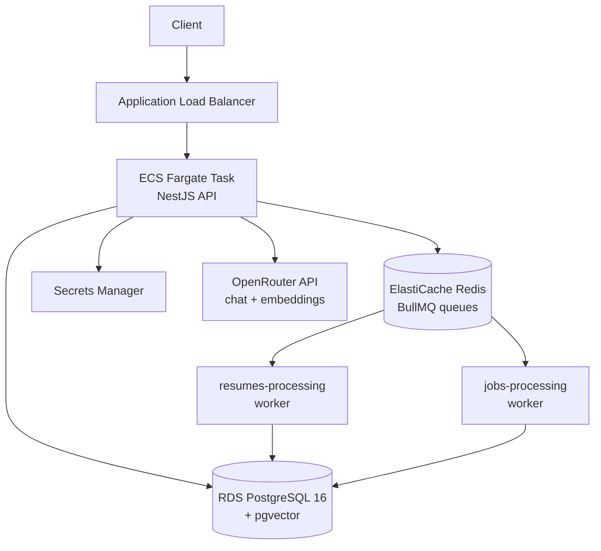

# Job Platform Backend

Upload your CV, get matched to relevant job postings, and see which of your LinkedIn connections already work at those companies — then generate a referral request message for them.

Built with NestJS, PostgreSQL + pgvector, Redis/BullMQ, and deployed on AWS ECS Fargate.

---

## The problem

Most job applications go into an applicant tracking system and are never seen by a human. A referral from someone inside the company changes that — the application gets looked at.

The information needed to find those referrals already exists: your CV, the job posting, and your LinkedIn connections. It's just scattered across three places that don't talk to each other. This project connects them.

## How it works

1. **Upload a CV** (PDF or DOCX). The text is parsed and an LLM extracts structured skills. A 1024-dimension embedding is generated in the background.
2. **Job postings are indexed** the same way — each posting gets its own embedding when created.
3. **Matching** combines semantic similarity (pgvector cosine distance) with rule-based scoring on skills and experience level. It works in both directions: find jobs for a CV, or find CVs for a job.
4. **Network lookup** takes the company behind a matched posting and cross-references it against your imported LinkedIn connections. If someone you know works there, you get their name, position, and a generated referral message tailored to the role and your skills.

## Architecture



Embedding generation is expensive and slow, so it never blocks a request. `POST /jobs` returns immediately and pushes a job onto a BullMQ queue; a worker picks it up, calls the embedding API, and writes the vector back to the `vector(1024)` column.

## Technology choices

**pgvector over a dedicated vector database.** The embeddings live in the same rows as the job and resume data. A single SQL query can filter by location, salary, and visa sponsorship *and* order by vector distance. Splitting this across Postgres and a separate vector store would mean two round trips and reconciliation logic for a dataset this size.

**BullMQ over synchronous processing.** Parsing a PDF and generating an embedding takes several seconds. Doing that inside an HTTP request would make the API unusable. The queue also gives retries and visibility into failed jobs for free.

**Prisma v7 with the driver adapter pattern.** The new `prisma-client` generator uses a query compiler instead of the Rust engine binary, which keeps the Docker image small. pgvector columns are declared as `Unsupported("vector(1024)")` and queried through raw SQL, since Prisma has no native vector type.

**OpenRouter over a direct provider integration.** One API surface for both chat and embeddings, and model selection is a config change rather than a code change. Currently running on free-tier models.

**LinkedIn CSV import over the LinkedIn API.** LinkedIn's API does not expose a user's connection list. The data export CSV does, and users can download it themselves — no partnership agreement required.

## API

Authentication is JWT. LinkedIn OAuth is available as an alternative sign-in (implemented on `passport-oauth2` directly, since `passport-linkedin-oauth2` still targets the deprecated v2/me endpoint).

| Method | Endpoint | Description |
|---|---|---|
| POST | `/auth/register` | Create account |
| POST | `/auth/login` | Get JWT |
| GET | `/auth/linkedin` | LinkedIn OAuth flow |
| PATCH | `/users/me/profile` | Target roles, locations, salary, tech preferences |
| POST | `/resumes/upload` | Upload PDF/DOCX, triggers parsing + embedding |
| GET | `/resumes/:id/matching-jobs` | Ranked job matches for a CV |
| POST | `/jobs` | Create posting, triggers embedding |
| GET | `/jobs/:id/matching-resumes` | Ranked CV matches for a posting |
| GET | `/jobs/:id/network` | Your connections at this company |
| GET | `/jobs/:id/referral-message/:connectionId` | Generated referral request |
| POST | `/connections/import` | LinkedIn connections CSV |
| POST | `/applications` | Track an application |
| GET | `/analytics/summary` | Application funnel stats |

### Example: finding your network at a company

```http
GET /jobs/8f3a2b1c-.../network
Authorization: Bearer <token>
```

```json
{
  "companyName": "Acme Corp",
  "connectionCount": 2,
  "connections": [
    {
      "id": "a1b2c3d4-...",
      "firstName": "Jane",
      "lastName": "Doe",
      "position": "Senior Backend Engineer",
      "profileUrl": "https://linkedin.com/in/janedoe",
      "connectedAt": "2024-03-15T00:00:00.000Z"
    }
  ]
}
```

Then, for a message tailored to that person and the role:

```http
GET /jobs/8f3a2b1c-.../referral-message/a1b2c3d4-...
```

The generator pulls the top skills from your active CV and combines them with the job title and company name.

## Running locally

```bash
git clone https://github.com/bahattinbober/job-platform-backend.git
cd job-platform-backend
npm install

cp .env.example .env   # fill in OPENROUTER_API_KEY and JWT_SECRET

docker compose up -d   # Postgres 16 + pgvector, Redis
npx prisma migrate deploy
npm run start:dev
```

The API listens on port 3000. `GET /health` returns `{"status":"ok"}`.

## Deployment

The production stack runs entirely on AWS:

- **ECS Fargate** — containerized NestJS app, no servers to manage
- **RDS PostgreSQL 16** — pgvector extension enabled, private subnet only
- **ElastiCache Redis** — BullMQ backend, reachable only from the ECS security group
- **Application Load Balancer** — stable public endpoint, health checks on `/health`
- **Secrets Manager** — database URL, JWT secret, and API keys injected at container start by the ECS execution role; never stored in the task definition
- **ECR** — image registry

Network access is tightly scoped: the load balancer is the only thing exposed to the internet, the application accepts traffic only from the load balancer's security group, and the database and cache accept traffic only from the application's. Rules reference security groups rather than IP addresses, so they survive task restarts.

> **Note:** the AWS infrastructure is currently torn down to avoid running costs on a portfolio project. Database snapshots and a full configuration record (`infrastructure-snapshot.md`) are retained. Rebuilding it as Terraform is the next step.

## Notes on a few problems worth documenting

**`sslmode` in the connection string silently overrides the `ssl` config object.** Prisma's `PrismaPg` adapter passes the connection string to `node-postgres`, which currently treats `sslmode=require` as `verify-full`. RDS certificates are signed by Amazon's own CA, which isn't in Node's trust store, so the connection fails with `self-signed certificate in certificate chain`. The fix was to parse the URL manually and pass host, port, user, password, and database as separate fields — a single source of truth for the SSL configuration.

**`docker run --env-file` does not strip quotes.** `dotenv` does. A `.env` file that works locally can produce a malformed connection string inside a container.

**The `awslogs` driver drops buffered log lines when a container is terminated.** During a rolling deployment this means the last few log lines never reach CloudWatch. An absent log entry is not evidence that work didn't happen — the queue state in Redis and the row in the database are.

## Stack

TypeScript · NestJS 11 · Prisma 7 · PostgreSQL 16 · pgvector · Redis · BullMQ · Docker · AWS (ECS, RDS, ElastiCache, ALB, ECR, Secrets Manager)
